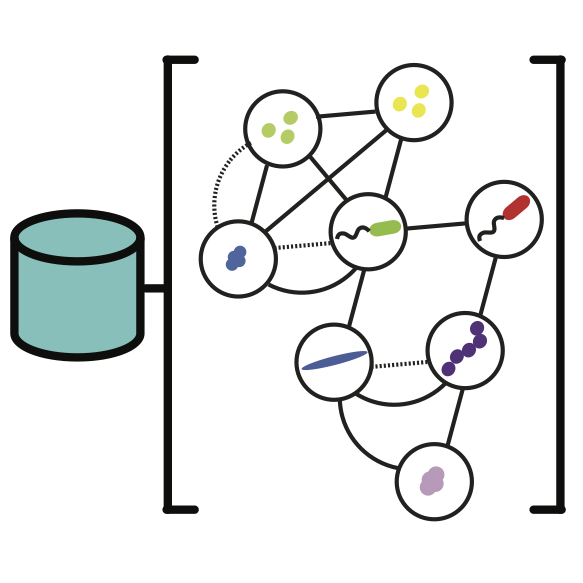

# Portfolio

This page highlights a selection of my software, analyses, and visualization projects.

## Software

I have developed software releating to the processing and analysis of next-generation sequence data.

<h3>MetaPathways</h3>

A high-performance pipeline for the analysis of next-generation environmental datasets allowing the systematic annotation and comparison of thousands of metagenomic samples.

<a class="btn btn-default" href="https://github.com/hallamlab/metapathways" role="button">View details »</a>

<h3>Master-worker</h3>

Designed a distributed Master-worker algorithm for the scheduling of compute tasks to multilple HPC computational grids. Implemented as a feature of the <a href="http://ieeexplore.ieee.org/xpl/articleDetails.jsp?arnumber=6845516">MetaPathways v2.0</a> to process computationally intensive homology-search tasks.

<a class="btn btn-default" href="https://github.com/hallamlab/metapathways2" role="button">View details »</a>

<h3>FastLSA</h3>

Hello

<a class="btn btn-default" href="#" role="button">View details »</a>

## Analytics

I've been involved in a number of analysis of unstructured datasets from beginning to end. Applying a number of statistical and machine learning models and the [ggplot2](http://ggplot2.org/) visualization framework. I am an avid user of  [Knitr](http://yihui.name/knitr/), [RMarkdown](http://rmarkdown.rstudio.com/), and [RStuido](http://www.rstudio.com/) for reproducible data analysis. 

<h3>Single Cell Genomes</h3>

Hello

<a class="btn btn-default" href="https://github.com/nielshanson/microfluidic_single_cells" role="button">View details »</a>

<h3>Metabolic Pathways</h3>

Hello

<a class="btn btn-default" href="#" role="button">View details »</a>

<h3>Carbohydrate Degradation</h3>

Hello

<a class="btn btn-default" href="#" role="button">View details »</a>

## Visualization

I am also interested in developing new interactive visualizations using the [d3.js](http://d3js.org/) JavaScript library.

<h3>Heatmap</h3>

Hello

<a class="btn btn-default" href="#" role="button">View details »</a>

<h3>Bubble Plot</h3>

Hello

<a class="btn btn-default" href="#" role="button">View details »</a>

<h3>Dendrogram</h3>

Hello

<a class="btn btn-default" href="#" role="button">View details »</a>

